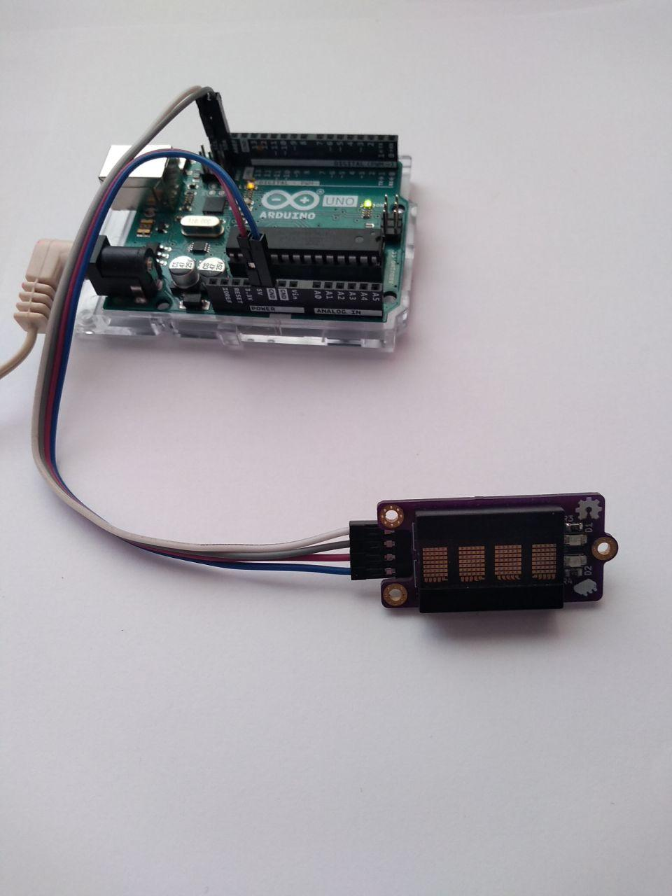

# Arudino Dot-matrix Display Adapter Library

This project is an Arduino-compatible library for an [PD243x I²C Display Adapter Board](https://github.com/galjonsfigur/PD243X-I2C-Adapter).
It can be used on any Arduino-compatible environment that supports `Wire`
library. Tested on Arduino Uno and STM32 "Blue Pill" boards, but should work fine
regardless of the board as long as there is Arduino platform for it. It can be
used both with Arduino IDE and PlatformIO environments.

### Documentation
All API documentation can be found [here](docs/). It contains description of every
method and functionalities of this library. There is also folder with examples,
which can be found [here](examples/).

### Demo

### License
[MIT](LICENSE.md)