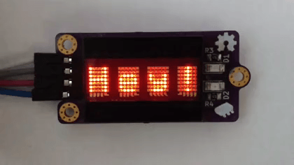

# Arduino Dot-Matrix Library

## Display Attributes Example

Code: [DisplayAttributes.ino](/examples/DisplayAttributes/DisplayAttributes.ino)

This example shows how to use various display attributes. It should print message `Hey!` and enable different attributes every one second.

