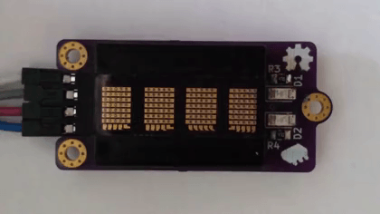

# Arduino Dot-Matrix Library

## Write without delay() Example

Code: [WriteWithoutDelay.ino](/examples/WriteWithoutDelay/WriteWithoutDelay.ino)

This example shows usage of `sendChar` function to fill the screen immediately. This can be very useful when user wants to have full control of the display itself. Usage of `delay()` function in the example itself is purely for cosmetic reasons.

