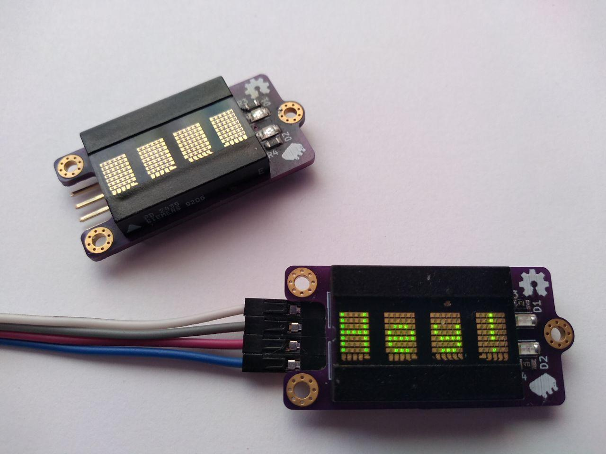

This project is an Arduino-compatible library for an PD243x I²C Display Adapter Board.
PD245x displays are small four-digit alphanumeric dot-matrix displays avarible in various colors.

It can be used on any Arduino-compatible environment that supports `Wire`
library. Tested on Arduino Uno and STM32 "Blue Pill" boards, but should work fine
regardless of the board as long as there is Arduino platform for it.

More information can be found at [project page](https://github.com/galjonsfigur/Arduino-DotMatrixLibrary).

This site contains API and examples description, both of which can be found in their respective sections of this documentation.